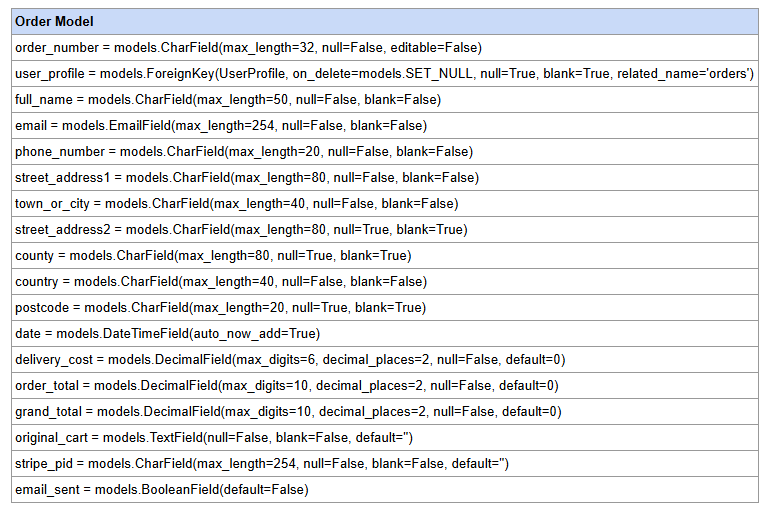
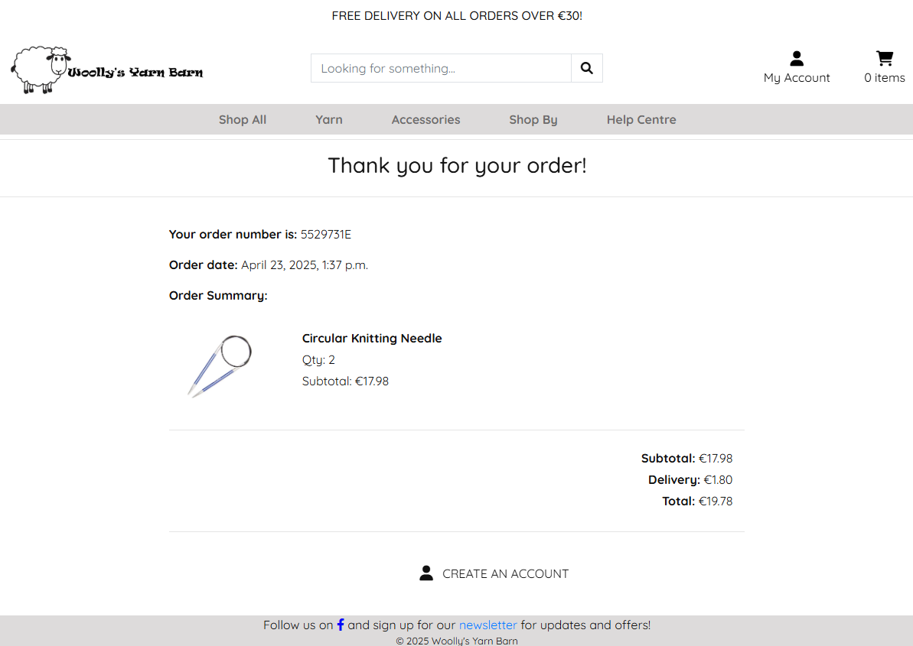

# Woolly's Yarn Barn

## Introduction to Woolly's Yarn Barn Website

Woolly's Yarn Barn is an eCommerce website designed to bring the cozy charm of knitting and crochet into the digital age. This website showcases a fully functional online store that sells a curated selection of yarns, knitting and crochet supplies for crafters of all skill levels.

The site demonstrates practical implementation of features such as product listings, cart functionality, secure checkout with Stripe integration, and responsive design. 

Whether you're a beginner looking for your first skein of yarn or a seasoned maker in search of quality tools, Woolly's Yarn Barn aims to provide a seamless and enjoyable shopping experience.

You can view Woolly's Yarn Barn [here](https://woollys-yarn-barn-c013ed10e4a8.herokuapp.com/)

Git Hub repository: [here](https://github.com/catgriffin85/woollys_yarn_barn)

Link to admin panel: [here](https://woollys-yarn-barn-c013ed10e4a8.herokuapp.com/admin//)

<u>Admin login:</u>

username: superuser

password: WoollysYarnBarn

## Business Model & Marketing Strategy

Woolly’s Yarn Barn is an e-commerce platform dedicated to serving the knitting and crochet community with high-quality yarns, needles, hooks, and essential accessories. Built with Django and deployed on Heroku, this platform offers a seamless online shopping experience, complete with user authentication, a customizable cart system, secure Stripe payments, and admin-side order management.

Woolly’s Yarn Barn operates on a B2C (Business-to-Consumer) model, providing:

* Product Sales: Yarn in various weights and colours, knitting needles, crochet hooks, and other crafting tools.
* Niche Targeting: Focused on hobbyists, small craft businesses, and fiber art enthusiasts who value quality and variety.
* Customer Accounts: Optional registration allows users to manage orders, save addresses, and subscribe to newsletters.
* Secure Transactions: Integrated Stripe payment gateway ensures secure, reliable payments.

To attract, convert, and retain customers, Woolly’s Yarn Barn employs the following digital marketing techniques:

Search Engine Optimization (SEO)

* Descriptive, keyword-rich product names and meta tags for better discoverability.

Email Marketing

* Newsletter sign-ups with welcome confirmation emails.

Community Building

* FAQ and contact forms help streamline customer support and build trust.

## Project Goals

* To create a website that is easy for users to navigate and use.
* To create a visually appealing website.
* Allow users to buy and make payments on items.
* Have a website that is responsive on all devices.
* To create an admin panel for a superuser to manage stock, orders and contacts.

## Key Features

* <strong>Homepage: </strong> A bright and engaging page to peak users interest.
* <strong>Stock Page: </strong> A page displaying all stock on the website that can be filtered by category and sorted by price, by category or alphabetically.
* <strong>Shopping Cart: </strong> A shopping cart where users can add, edit and remove items they would like to purchase.
* <strong>Checkout: </strong> A checkout page that users can use to complete payments when purchasing items from the website.
* <strong>Help Center: </strong> Users can review FAQ's, our privacy policy and contact our customer support team.
* <strong>Profile: </strong> Users can sign up, log in and log out to buy items and review their delivery details and previous orders.

This project has been developed using Agile methodology, ensuring iterative improvements and a user-focused design.

## Agile Development

Link to my [GitHub Project](https://github.com/users/catgriffin85/projects/5)

This was my second experience with Agile Development as I used it in my PP4. Again I chose to use the Kanban framework alongside the MoSCoW prioritization method. To manage the workflow, I utilized GitHub Projects to create a Kanban board.

Creating all the Epics and User Stories was time-consuming especially as it was just me creating them. However, in a team setting there are significant advantages to this approach, as it promotes organization and collaboration.

I created 4 columns on my Kanban framework- Open, In progress, Done and No Longer Required. 

For the MoSCoW priorisation I used - Must Have (MVP), Should Have and Nice to Have.

Example:

## User Stories

<strong>Payment System Integration</strong>

As a customer, I want to add products to a shopping cart so that I can purchase multiple items at once.

Acceptance Criteria:
* Products can be added to the cart from the product page.
* Cart displays the correct total price and item count.
* Users can remove items from the cart before checkout.

As a customer, I want to make payments using a secure online payment system (e.g., Stripe) so that I can complete my purchase confidently.

Acceptance Criteria:
* Payment gateway is integrated securely using HTTPS.
* Users receive confirmation of successful payments.
* Failed payments display appropriate error messages.

As a customer, I want to receive feedback on my purchase status so that I know if my transaction was successful or failed.

Acceptance Criteria:
* Success messages for completed payments.
* Error messages for failed transactions.
* Redirection to an order summary page upon success.
________________________________________

<strong>User Authentication & Authorization</strong>

As a new user, I want to register an account so that I can access personalized features.

Acceptance Criteria:
* Registration form with validation for email and password.
* Confirmation email sent upon successful registration.
* Users cannot register with duplicate emails.

As a returning user, I want to log in so that I can access my account and order history.

Acceptance Criteria:
* Login form with email and password validation.
* Error message for incorrect credentials.
* Successful log in redirects to the user dashboard.

As an admin, I want to manage products and orders so that I can update inventory and track sales.

Acceptance Criteria:
* Admin dashboard with CRUD functionality for products.
* Role-based access control preventing non-admin users from accessing the admin panel.
* The order management system displays status and details.
________________________________________

<strong>Stock Management</strong>

As a customer, I want to view stock categories and details so that I can make informed purchase decisions.

Acceptance Criteria:
* Category filters on the stock page.
* Detailed stock pages with descriptions, prices, and images.
* Pagination for stock listings.

As an admin, I want to add, edit, and delete products so that I can keep the inventory up to date.

Acceptance Criteria:
* Form for creating and editing products with validation.
* Confirmation prompts for deleting products.
* Consistent URL structure for product management.
________________________________________

<strong>SEO & Marketing</strong>

As a site owner, I want to include SEO-friendly meta tags so that search engines can index my site effectively.

Acceptance Criteria:
* Meta titles and descriptions for each page.
* Sitemap.xml and robots.txt files included.
* No broken links or missing alt text for images.

As a user, I want to sign up for newsletters so that I can receive updates and promotions.

Acceptance Criteria:
* Signup form with email validation.
* Confirmation email for successful subscription.
* Unsubscribe option available.

As a site owner, I want to create a Facebook Business Page so that I can reach a broader audience.

Acceptance Criteria:
* Page linked to the website.
* Social media icons displayed on the website.
* Consistent branding across the website and social media.
________________________________________

<strong>Database & Security</strong>

As a developer, I want to design a relational database schema so that data is stored efficiently and relationships are clear.

Acceptance Criteria:
* Three or more original custom Django models.
* Clear relationships (e.g., Foreign Keys) between models.
* Consistent and logical file structure.

As a site owner, I want to ensure secure user data handling so that users' information remains private.

Acceptance Criteria:
* Environment variables for secret keys.
* DEBUG mode turned off in production.
* UX Design & Testing

As a user, I want a responsive and intuitive interface so that I can browse the site easily on any device.

Acceptance Criteria:
* Responsive design for mobile, tablet, and desktop.
* Consistent navigation menu across all pages.

As a tester, I want to perform manual tests so that I can ensure the application is bug-free.

Acceptance Criteria:
* Manual testing for usability and UX.
* Error handling and validation tested.
________________________________________

<strong>Reviews & Ratings</strong>

As a customer, I want to leave reviews and ratings for products so that I can share my experience.

Acceptance Criteria:
* Customers can submit reviews with a rating (1-5 stars).
* Reviews are displayed on product pages.
* Admin can moderate reviews.

As a customer, I want to read reviews from other buyers so that I can make informed decisions.

Acceptance Criteria:
* Reviews are sorted by most recent or highest-rated.
________________________________________

<strong>Customer Support</strong>

As a customer, I want to contact customer support so that I can get help with my orders.

Acceptance Criteria:
* Contact form with name, email, and message fields.
* Auto-response email confirming receipt of the request.
* Option to check FAQs before submitting a query.
________________________________________

<strong>Account Management</strong>

As a customer, I want to update my account details so that I can keep my information current.

Acceptance Criteria:
* Ability to edit personal details like name, email, and address.
* Password change functionality with validation.
* Option to delete account with confirmation prompt.

________________________________________

### Prioritisation of User Stories

<strong>Must Have (MVP)</strong>
* Stock management
* User Authentication & Authorization
* Payment System Integration
* Account Management
* SEO & Marketing
* Database & Security
* UX Design and Testing

<strong>Should Have</strong>
* Reviews and ratings
* Customer Support

<strong>Nice to Have</strong>
* Reviews and ratings - this was originally a "Should Have" but got deprioritised 

## Design

<strong>Look and feel</strong>

For the design of this website, I wanted to create a fun-looking website that was still professional. The image on the homepage is bright and colourful to encourage users to stay and browse the website. The sales pages are bright and structured making it easy for users to find what they are looking for. 

<strong>Font</strong>

I used [Google Fonts](https://fonts.google.com/) for my font selection.

Quicksand was used as the font for this website. I chose this font because I felt like it didn't have a very formal feel to it but was still easy to read. Fall back font is Sans-serif.

## Wireframes

Before starting the project, I created wireframes to map out the initial design and functionality. These wireframes served as a blueprint to guide the development process. I stuck with the original design for the majority of the project, however, I deviated from the original plan in some areas. By not sticking rigidly to my wireframes I was able to improve on the look and feel as the project progressed which I feel elevated the project's quality beyond the initial concept.

<strong>Homepage wireframe</strong>

<strong>Stock Page wireframe</strong>

<strong>Stock Detail Page wireframe</strong>

<strong>Delivery & Payment Page wireframe</strong>

<strong>Checkout Page wireframe</strong>

<strong>Contact Page wireframe</strong>

## Database Schemes

## Tools and technologies used

<strong>Languages and Frameworks</strong>

This project was created using the following languages and frameworks:

* Django as the Python web framework.
    * Python as the backend programming language.
* JavaScript as the front-end programming language and scripting language for dynamic web content.
* HTML as the markup language and templating language.
* CSS as the style sheet language.
* Bootstrap 5 as the CSS framework.

<strong>Django Packages</strong>

Django installs some packages by default, and I installed some packages. Below is a list of the main packages I used and a description. Description taken from the web.

Django Python - pip3 install Django~=4.2.1

_Gunicorn_

gunicorn is a production equivalent of the manage.py run server used in development but with speed and security optimisation.

_Whitenoise_

WhiteNoise works with any WSGI-compatible app but has some special auto-configuration features for Django. WhiteNoise takes care of best practices.

_Psycopg2_

psycopg2 is a driver for interacting with PostgreSQL databases using Python. The dj-database-url Python package is a utility to connect Django to a database using a URL.

_Allauth_

Django-allauth is a Django package that provides a set of views, templates, and helper functions to handle user authentication, registration, and account management.

_Django-crispy-forms_

Django-crispy-forms provides you with a |crispy filter and  tag that will let you control the rendering behavior of your Django forms in a very elegant and DRY way. Have full control over custom form templates without writing them.

_cloudinary_

A service and Python SDK for managing, storing, and delivering media assets like images and videos.

_django-cloudinary-storage_

A Django storage backend that integrates Cloudinary for managing media files.

_pillow_

A Python imaging library (PIL fork) for opening, manipulating and saving image files.

_stripe_

The official Python library for integrating Stripe’s payment processing APIs into applications.

<strong>Other tools used</strong>

* [Font Awesome](https://fontawesome.com/) was used for all icons.
* [Favicon.io](https://favicon.io/) was used to create the favicon.
* [Cloudinary](https://cloudinary.com/) for image storage.
* [GitHub](https://github.com/) for hosting repositories.
* [Heroku](https://www.heroku.com/home) where the website is deployed.

## Features

I created this website with a user-friendly design with the hope of offering a seamless experience for both users and administrators. Below is an overview of the key pages and features.

1. <strong>Navigation Bar</strong>

 The navigation bar is designed to provide users with a seamless and intuitive browsing experience. At the top of every page, the navigation bar ensures easy access to the website’s key features. For new users, it includes options to Sign Up or Sign In, allowing them to quickly create an account or log in to their existing one. Once logged in, the navigation bar dynamically updates, offering a personalized link to My Profile where users can view and manage their delivery details and also view previous orders. This adaptive design ensures a user-friendly experience, guiding visitors to the most relevant options based on their needs and enhancing the overall functionality of the website.

 View of nav bar before a user logs in:

 

 

 

 

 

 

 View of the nav bar on a smaller screen:

 

 

 The user has the option to sign up a new account or sign in.

 

 If the user selects Sign Up,  it will bring them to the Sign Up page: 

 

 If the user selects Sign In, it will bring them to the Sign In page:

 

 After registering a new account or logging into an existing one, users will be redirected to the homepage, where the navigation bar dynamically updates to display personalised links.

 

 

 If the user is a superuser they will see additional options for Stock Management.

 

 The user now has a direct link to their profile and also an option to log out. 

 

2. <strong>Footer</strong>

 I went with a simplistic footer that contains the website name, a link to the Facebook page and a link to sign up for the newsletter.

 

 Clicking on the Facebook link with open Woolly's Yarn Barn Facebook page in a new tab.

 [Facebook Link](https://www.facebook.com/profile.php?id=61573637325603)

 

 I decided to go with my own newsletter links instead of setting up one through mailchimp. A user can enter their email address to subscribe. These details are saved to a database and can be viewed in the admin panel. If a user wants to unsubscribe they can follow the link to the unsubscribe page and enter their email address again. The admin panel will be updated to show the user has unsubscibed. 

 

 

 

3. <strong>Homepage</strong>

 The homepage serves as the welcoming face of the website, featuring a bright and fun design that reflects the brand's identity. It offers visitors an immediate sense of what the business is all about.

 I kept the homepage simple with just a small introduction to the website and a button to follow for users to start shopping. 

 

4. <strong>Stock Page</strong>

 Using either the homepage button or the navigation bar, users can view the items for sale on the website. There are 3 main categories of items - yarn, yarn packs and accessories. Users can use the search bar, the navigation bar dropdowns or the sort filter to find the item they are looking for. Each item is in its own responsive card and once clicked it will bring the user to a new page that will provide more detail on the item. 

 Most items will have additional options eg. yarn will give users the option to select a weight and a colour and knitting needles and crochet hooks will give users the option of sizes. Yarn packs and accessory packs do not have options.

 

 

 

 

 From here the user can search other items in the same category, go back to the stock page or add the item to the cart.

5. <strong>Shopping Cart</strong>

 When "Add to Cart" is selected the user will see a success message confirming their item has been added to the cart and a link to the cart. The message will also advise how much more the user will need to spend to avoid the delivery charge. 

 
 

 

 From the cart, users can update the quantity of their items and also remove any unwanted items.

 

 

 Once in the cart, the user has the option to click the "Keep Shopping" button to return to the stock page or they can choose "Secure Checkout" and complete their purchase.

6. <strong>Checkout</strong>

 The checkout is comprised of 4 sections - Your Details, Delivery Details, Order Summary and Payment. If the user has no profile or is not logged in the form will be blank. If the user is logged in to their profile and has previously saved their details, their email address and delivery address will be pre-populated.

 

 

 

 

 Once the user has completed the form they can either "Return to Cart" or "Complete Order".

 If the checkout form is completed correctly and all fields are valid the order will be processed when "Complete Order" is clicked. To avoid creating duplicate orders from the checkout and the webhook I had to add a step so only the webhook created the order. Because of the delay between the checkout view and the webhook, orders were failing so the user is now directed to an order is processing page and once they refresh the page the order will have been created and they can view the order complete page.

 

 If the user is not logged into a profile, they will be encouraged to create an account. 

 

 If the user is logged into their profile, they will be provided with a link to view their profile and their orders.

 

 When the order is complete the user will receive an order confirmation email.

 

 The Stripe dashboard should be checked to ensure the payment intent was successful.

 

7. <strong>User Profile</strong>

 The profile page is only available to logged-in users. This page will show the user's saved phone number, delivery address and the users order history.

 

 Phone number and delivery address can be updated from this page. A success message will display once the update has been saved. 

 

 A user may also delete their profile. When "Delete Profile" is clicked the user will be brought to a confirmation page so they can confirm the delete.

 

 The user can click into their past orders and review the order complete page again for that order with a message to advise the user is looking at past order confirmation.

 

 Clicking "Back to Profile" will bring the user back to their profile page.

8. <strong>Customer Service</strong>

 If the user is having issues and would like some assistance they can click on Help Center in the navigation bar and select FAQs. The FAQ page has 5 sections -

* Delivery
* Returns & Refunds
* Help with my Order
* Item & Stock Queries
* Payments

 

 To see the answer to the FAQ the user must click on the question and the card expands to show the answer.

 

 If the user scrolls to the end of the page they will see a link to contact the Customer Service team. This website encourages the user to self-service before offering the user a contact method. 

 

 The user will go through to a blank Contact form. They will be asked for their name and email address and to select a reason for their contact. 

 

 Once a reason has been selected the user will be shown related FAQs in a final attempt to get the user to resolve their query before contacting the company.

 

 If an FAQ has helped the user and they no longer need to contact the company they can select "Yes, thank you" and the form will close and the user will be redirected back to the homepage.

 

 If the user still requires assistance, they can click "No, I still need help" and a text box will open for them to type up their query.

 

 The user will then click submit and the contact will be logged in the database. The user will receive onscreen success messages as well as an email confirmation.

 
    
 

9. <strong>404 Page</strong>

 If a URL is mistyped or if a user tries to access pages that are moved or deleted without redirection then they will receive a 404 page. This page will bring the user back to the homepage.

 

10. <strong>Super User</strong>

 Super users can log into the admin panel where they have full control over the databases and users.

 

 On this website, the admin panel has several databases for the super user to manage: 

 Stock Categories:

 

 Stock:

 

 Users:

 

 FAQ Topics:

 

 FAQs:

 

 All FAQs have a "published" flag. Only questions that have this box ticked will show on the website.

 

 User Contacts:

 

 A super user has an additional option when logged into their profile in the My Account section - Stock Management. From here the superuser can create new stock items for the website without the need to access the admin panel.

 

 

 They can also edit or delete existing items on the website without going into the admin panel. They have 2 options, they can update from the item cards on the stock page or the stock detail page.

 

 

 When "Edit" is clicked the superuser is brought to a new form that will allow them to edit the item they have selected.

 

 

 When "Delete" is clicked, they will be brought to a delete confirmation page before the item is deleted.

 

### Future Features

I would like to set up a section for reviews. Unfortunately, time constraints impacted my ability to include an option for users to review products and read other users' reviews. 

I would also like to include a returns section. To allow users to go into orders and have an option for a return. Once a return is selected, they would receive an email with a return label attached and the order would be updated with a return flag.

## Testing

To ensure the website meets all functional and usability requirements, a series of User Acceptance Tests (UAT) were conducted. These tests focused on critical features of the website, including the homepage layout, navigation links, and key user interactions. The objective was to verify that each feature behaves as expected and delivers a seamless experience for users.

Each test case includes the expected outcome and the actual result. These tests help identify potential issues and ensure the website provides an optimal user experience.

Link to testing document: [here](https://docs.google.com/spreadsheets/d/1UMBrraRjk3qJwyAmRRb6Vx1KmlkfqZYi1BrFD7Zkei0/edit?gid=84845225#gid=84845225)

To check my HTML files I used: [W3C Markup Validation Service](https://validator.w3.org/#validate_by_input)

I used "View Page Source" for the html as the Django tags were causing invalid errors.

* index.html - Document checking completed. No errors or warnings to show.
* stock.html - Document checking completed. No errors or warnings to show.
* stock_detail.html - Document checking completed. No errors or warnings to show.
* add_stock.html - Document checking completed. No errors or warnings to show.
* edit_stock.html - Document checking completed. No errors or warnings to show.
* cart.html - Document checking completed. No errors or warnings to show.
* checkout.html - One error showing: Attribute placeholder not allowed on element select at this point. select name="country" placeholder="Country *" class="stripe-style-input lazyselect form-control" required id="id_country". I can't find this element to fix it. In my checkout html this is showing as: {{ order_form.country | as_crispy_field }}.
* order_complete_pending.html - Document checking completed. No errors or warnings to show. 
* order_complete.html - Document checking completed. No errors or warnings to show.
* faqs.html - Document checking completed. No errors or warnings to show.
* customer_service.html - Document checking completed. No errors or warnings to show.
* profiles.html - One error showing and it is the placeholder for country error again: Attribute placeholder not allowed on element select at this point. select name="country" placeholder="Country *" class="stripe-style-input lazyselect form-control" required id="id_country". I can't find this element to fix it. In my checkout html this is showing as: {{ order_form.country | as_crispy_field }}.

To check my CSS file I used: [W3C CSS Validation Service](https://jigsaw.w3.org/css-validator/#validate_by_input)

Both my CSS files came back with no errors

To check my Javascript files I used: [jshint](https://jshint.com/)

stripe_elements.js

17 warnings came back but no errors. The warnings were either 'const' is available in ES6 (use 'esversion: 6') or Mozilla JS extensions (use moz) or 'template literal syntax' is only available in ES6 (use 'esversion: 6').

I used "python -m flake8 --exclude .venv,.vscode, migrations" in my terminal to check my python code for any linting errors and to ensure my code was PEP8 compliant. There are still some errors showing for lines too long in my settings file but they cannot be fixed due to the type of code that it is. There are also errors showing for the project-level urls.py file, this is due to the addition of the 404 error page code. I have included an example of some of this code below.

Lighthouse report for the homepage:

Best Practices scored low. This project uses Stripe for secure payment processing, which involves loading Stripe’s JavaScript SDK from js.stripe.com. As a result, Lighthouse flags the use of third-party cookies set by Stripe (e.g., __Host-session, cookie-perms) and lowers the “Best Practices” score. These cookies are necessary for secure transaction handling, fraud prevention, and maintaining session state. While this warning does not indicate a security issue, it reflects broader browser trends toward limiting third-party cookies. Stripe is a PCI-compliant service, and its cookie usage aligns with industry standards for secure online payments.

## Bugs

<strong>Fixed Bugs</strong>

Homepage image - after deployment to Heroku the homepage image stopped loading. When running collectstatic the name of the image was changing. This meant the link in my CSS file could not find it. I moved the css for my body element to my base.html and that fixed it.

Newsletter resubscibing - for the newsletter subscription if I unsubscribed and then tried to resubscribe Django was preventing it as the email address was already created. I had to update my views.py to override Django.

Order duplication - once I set up my webhook orders were duplicating. The order view was creating an order and then the webhook was creating the order. I had to remove the order creation section from the order views. Then because the order was completed in the view before the webhook was completed, orders were showing as failed to the user but were still being created. I had to add another step into the order process and delay the order confirmation page. This gave the webhook time to create the order and the order confirmation page could then find the order.

Order confirmation emails sent twice - after fixing the duplicate order issue I had still left in code that sent out email confirmation in my views file. I removed that code and fixed this bug. 

Update and remove cart items - as many of the items on my site have attributes eg. size, weight and colour I encountered issues when trying to update or remove them from the cart. I was originally using just the item_id so it would remove all items even if some of the items had different attributes eg. 5mm Circular Knitting Needles and 6mm Circular Knitting Needles and updating them would cause a new item to be added to the cart with the new quantity and the original item would be unchanged. This bug required a lot of troubleshooting and many iterations of code before I got it working.

<strong>Unfixed Bugs</strong>

Success messages not showing after some actions - while majority of my messages are working, there are 2 that were picked up during testing that are not working - when item quantity in the cart is updated and when an existing stock item has been deleted. I've checked the code and can see no obvious issues as to why these messages are not showing when others are. As I am close to submission date I've decided to leave these bugs. The functionality that should be triggering these messages is working so I'm ok to leave them as bugs for now.

## Set Up GitHub Repository

Before deploying to Heroku, set up version control with GitHub:

1. Create a GitHub repository:

* Go to [github.com](https://github.com/) and log in or sign up.
* Click the New button to create a new repository.
* Give your repo a name, choose visibility (public or private), and create it.

2. Connect your local project to GitHub:

    git remote add origin https://github.com/your-username/your-repo-name.git

3. Add and commit your project files:

    git add .

    git commit -m "Initial commit"

4. Push to GitHub:

    git push -u origin main

## Deployment to Heroku

1. Update the requirements.txt File

    Ensure all dependencies are installed in your environment.

    Run: pip3 freeze > requirements.txt

    Add and commit the updated requirements.txt:

    git add requirements.txt

    git commit -m "Update requirements.txt"

    git push

2. Sign Up or Log In to Heroku

    Go to Heroku's website and log in or create a free account.

3. Create a New App

* From the Heroku dashboard, click the Create New App button.
* Enter a unique name for your app and select your region (e.g., United States or Europe).
* Click Create App.

4. Set Up Config Vars

* Navigate to the Settings tab of your newly created app.
* Scroll down to the Config Vars section and click Reveal Config Vars.
* Add the following variables:

        1. Key: CREDS - Value: Paste the entire contents of your creds.json file.

        2. Key: PORT - Value: 8000

* Click Add after entering each pair.

5. Configure Buildpacks

* Scroll down to the Buildpacks section.
* Click Add Buildpack and select Python. Save changes.
* Click Add Buildpack again and select Node.js. Save changes.
* Ensure Python is listed above Node.js. If not, drag Python to the top.

6. Create a Procfile

    In your project root, create a file named Procfile (no extension) with this content:

    web: gunicorn your_project_name.wsgi

    Add, commit, and push the Procfile:

    git add Procfile

    git commit -m "Add Procfile for Heroku deployment"

    git push

7. Connect to GitHub

* Go to the Deploy tab in Heroku.
* Under the Deployment Method section, select GitHub.
* Click Connect to GitHub and authenticate your GitHub account if prompted.
* In the search bar, enter the name of your GitHub repository and click Search.
* Once your repository appears, click Connect.

8. Deploy Your App

* Scroll down to the Manual Deploy section.
* Select the branch you want to deploy (e.g., main or master) from the dropdown.
* Click the Deploy Branch button.
* Wait for Heroku to build and deploy your app. Once complete, you’ll see a success message with a View App button to preview your app.

9. Enable Automatic Deploys (Optional)

* To enable automatic deployment from GitHub, toggle the Enable Automatic Deploys option under the Automatic Deploys section.
* This ensures your app rebuilds automatically every time you push new changes to GitHub.

10. Test Your App

* Click the View App button in Heroku to verify your app is running correctly.

## Conclusion

Woolly's Yarn Barn was inspired by my own passion for knitting and crochet, and I wanted to create a project that combined my personal interests with the technical skills developed throughout this course. Building a full stack e-commerce site gave me the chance to apply concepts in a practical, meaningful way, and helped reinforce many of the more complex areas of the course. While the module was challenging and content-heavy, working through this project significantly deepened my understanding and confidence. I'm pleased with the final outcome and grateful for the opportunity to bring something I'm passionate about into my learning journey.

I also want to give a special shout out to my mentor Spencer Barriball. He was such a big help on this project and gave me great direction and support. He is clearly passionate about helping his students and has been an absolute pleasure to deal with.