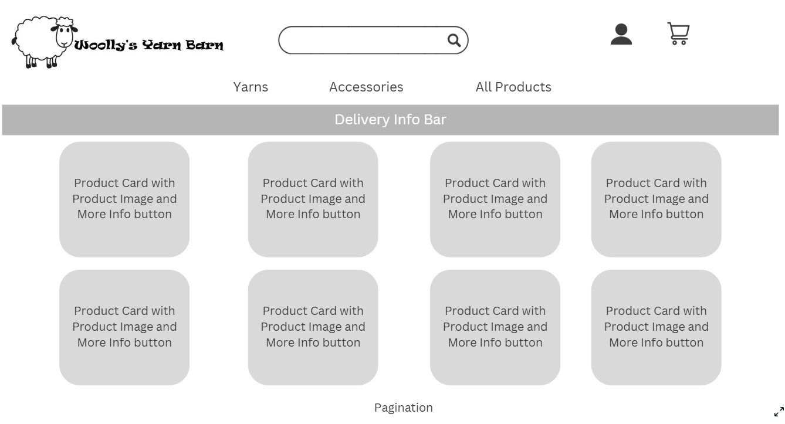

# Woolly's Yarn Barn

## Introduction to Woolly's Yarn Barn Website

Woolly's Yarn Barn an eCommerce website designed to bring the cozy charm of knitting and crochet into the digital age. This website showcases a fully functional online store that sells a curated selection of yarns, knitting and crochet supplies for crafters of all skill levels.

The site demonstrates practical implementation of features such as product listings, cart functionality, secure checkout with Stripe integration, and responsive design. 

Whether you're a beginner looking for your first skein of yarn or a seasoned maker in search of quality tools, Woolly's Yarn Barn aims to provide a seamless and enjoyable shopping experience.

You can view Woolly's Yarn Barn [here](https://woollys-yarn-barn-c013ed10e4a8.herokuapp.com/)

Git Hub repository: [here](https://github.com/catgriffin85/woollys_yarn_barn)

Link to admin panel: [here](https://woollys-yarn-barn-c013ed10e4a8.herokuapp.com/admin//)

<u>Admin login:</u>

username: superuser

password: SuperUser1

## Project Goals

* To create a website that is easy for users to navigate and use.
* To create a visually appealing website.
* Allow users to buy and make payments on items.
* Have a website that is responsive on all devices.
* To create an admin panel for a superuser to manage stock, orders and contacts.

## Key Features

* <strong>Homepage: </strong> A bright and engaging page to peak users interest.
* <strong>Stock Page: </strong> A page displaying all stock on the website that can be filtered by category and sorted by price, by category or alphabetically.
* <strong>Shopping Cart: </strong> A shopping cart where users can add, edit and remove items they would like to purchase.
* <strong>Checkout: </strong> A checkout page that users can use to complete payments when purchasing items from the website.
* <strong>Help Center: </strong> Users can review FAQ's, our privacy policy and contact our customer support team.
* <strong>Profile: </strong> Users can sign up, log in and log out to buy items and review their delivery details and previous orders.

This project has been developed using Agile methodology, ensuring iterative improvements and a user-focused design.

## Agile Development

Link to my [GitHub Project](https://github.com/users/catgriffin85/projects/5)

This was my second experience with Agile Development as I used it in my PP4. Again I chose to use the Kanban framework alongside the MoSCoW prioritization method. To manage the workflow, I utilized GitHub Projects to create a Kanban board.

Creating all the Epics and User Stories was time-consuming especially as it was just me creating them. However, in a team setting there are significant advantages to this approach, as it promotes organization and collaboration.

I created 4 columns on my Kanban framework- Open, In progress, Done and No Longer Required. 

For the MoSCoW priorisation I used - Must Have (MVP), Should Have and Nice to Have.

Example:

## User Stories

<strong>Payment System Integration</strong>

As a customer, I want to add products to a shopping cart so that I can purchase multiple items at once.

Acceptance Criteria:
* Products can be added to the cart from the product page.
* Cart displays the correct total price and item count.
* Users can remove items from the cart before checkout.

As a customer, I want to make payments using a secure online payment system (e.g., Stripe) so that I can complete my purchase confidently.

Acceptance Criteria:
* Payment gateway is integrated securely using HTTPS.
* Users receive confirmation of successful payments.
* Failed payments display appropriate error messages.

As a customer, I want to receive feedback on my purchase status so that I know if my transaction was successful or failed.

Acceptance Criteria:
* Success messages for completed payments.
* Error messages for failed transactions.
* Redirection to an order summary page upon success.
________________________________________

<strong>User Authentication & Authorization</strong>

As a new user, I want to register an account so that I can access personalized features.

Acceptance Criteria:
* Registration form with validation for email and password.
* Confirmation email sent upon successful registration.
* Users cannot register with duplicate emails.

As a returning user, I want to log in so that I can access my account and order history.

Acceptance Criteria:
* Login form with email and password validation.
* Error message for incorrect credentials.
* Successful login redirects to the user dashboard.

As an admin, I want to manage products and orders so that I can update inventory and track sales.

Acceptance Criteria:
* Admin dashboard with CRUD functionality for products.
* Role-based access control preventing non-admin users from accessing the admin panel.
* Order management system displaying status and details.
________________________________________

<strong>Stock Management</strong>

As a customer, I want to view stock categories and details so that I can make informed purchase decisions.

Acceptance Criteria:
* Category filters on the stock page.
* Detailed stock pages with descriptions, prices, and images.
* Pagination for stock listings.

As an admin, I want to add, edit, and delete products so that I can keep the inventory up to date.

Acceptance Criteria:
* Form for creating and editing products with validation.
* Confirmation prompts for deleting products.
* Consistent URL structure for product management.
________________________________________

<strong>SEO & Marketing</strong>

As a site owner, I want to include SEO-friendly meta tags so that search engines can index my site effectively.

Acceptance Criteria:
* Meta titles and descriptions for each page.
* Sitemap.xml and robots.txt files included.
* No broken links or missing alt text for images.

As a user, I want to sign up for newsletters so that I can receive updates and promotions.

Acceptance Criteria:
* Signup form with email validation.
* Confirmation email for successful subscription.
* Unsubscribe option available.

As a site owner, I want to create a Facebook Business Page so that I can reach a broader audience.

Acceptance Criteria:
* Page linked to the website.
* Social media icons displayed on the website.
* Consistent branding across the website and social media.
________________________________________

<strong>Database & Security</strong>

As a developer, I want to design a relational database schema so that data is stored efficiently and relationships are clear.

Acceptance Criteria:
* Three or more original custom Django models.
* Clear relationships (e.g., Foreign Keys) between models.
* Consistent and logical file structure.

As a site owner, I want to ensure secure user data handling so that users' information remains private.

Acceptance Criteria:
* Environment variables for secret keys.
* DEBUG mode turned off in production.
* UX Design & Testing

As a user, I want a responsive and intuitive interface so that I can browse the site easily on any device.

Acceptance Criteria:
* Responsive design for mobile, tablet, and desktop.
* Consistent navigation menu across all pages.

As a tester, I want to perform manual tests so that I can ensure the application is bug-free.

Acceptance Criteria:
* Manual testing for usability and UX.
* Error handling and validation tested.
________________________________________

<strong>Reviews & Ratings</strong>

As a customer, I want to leave reviews and ratings for products so that I can share my experience.

Acceptance Criteria:
* Customers can submit reviews with a rating (1-5 stars).
* Reviews are displayed on product pages.
* Admin has the ability to moderate reviews.

As a customer, I want to read reviews from other buyers so that I can make informed decisions.

Acceptance Criteria:
* Reviews are sorted by most recent or highest-rated.
________________________________________

<strong>Customer Support</strong>

As a customer, I want to contact customer support so that I can get help with my orders.

Acceptance Criteria:
* Contact form with name, email, and message fields.
* Auto-response email confirming receipt of the request.
* Option to check FAQs before submitting a query.
________________________________________

<strong>Account Management</strong>

As a customer, I want to update my account details so that I can keep my information current.

Acceptance Criteria:
* Ability to edit personal details like name, email, and address.
* Password change functionality with validation.
* Option to delete account with confirmation prompt.

________________________________________

### Prioritisation of User Stories

<strong>Must Have (MVP)</strong>
* Stock management
* User Authentication & Authorization
* Payment System Integration
* Account Management
* SEO & Marketing
* Database & Security
* UX Design and Testing

<strong>Should Have</strong>
* Reviews and ratings
* Customer Support

<strong>Nice to Have</strong>
* Reviews and ratings - this was originally a "Should Have" but got deprioritised 

## Design

<strong>Look and feel</strong>

For the design of this website, I wanted to create a fun looking website that was still professional. The image on the homepage is bright and colourful to encourage users to stay and browse the website. The sales pages a  bright and structured making it easy for users to find what they are looking for. 

<strong>Font</strong>

I used [Google Fonts](https://fonts.google.com/) for my font selection.

Quicksand was used as the font for this website. I chose this font because I felt like it didn't have a very formal feel to it but was still easy to read. Fall back font is Sans-serif.

## Wireframes

Before starting the project, I created wireframes to map out the initial design and functionality. These wireframes served as a blueprint to guide the development process. I stuck witht the orginal design for the majority of the project, however, I deviated from the original plan in some areas. By not sticking rigidly to my wireframes I was able to improve on the look and feel as the project progressed which I feel elevate the project's quality beyond the initial concept.

<strong>Homepage wireframe</strong>

<strong>Stock Page wireframe</strong>

<strong>Stock Detail Page wireframe</strong>

<strong>Delivery & Payment Page wireframe</strong>

<strong>Checkout Page wireframe</strong>

<strong>Contact Page wireframe</strong>

## Database Schemes

## Tools and technologies used

<strong>Languages and Frameworks</strong>

This project was created using the following languages and frameworks:

* Django as the Python web framework.
    * Python as the backend programming language.
* JavaScript as the frontend programming language and scripting language for dynamic web content.
* HTML as the markup language and templating language.
* CSS as the style sheet language.
* Bootstrap 5 as the CSS framework.

<strong>Django Packages</strong>

Django installs some packages by default and some packages I installed. Below are a list of the main packages I used and a description. Description taken from the web.

Django Python - pip3 install Django~=4.2.1

_Gunicorn_

gunicorn is a production equivalent of the manage.py runserver used in development but with speed and security optimisation.

_Whitenoise_

WhiteNoise works with any WSGI-compatible app but has some special auto-configuration features for Django. WhiteNoise takes care of best-practices.

_Psycopg2_

psycopg2 is a driver for interacting with PostgreSQL databases using Python. The dj-database-url Python package is a utility to connect Django to a database using a URL.

_Allauth_

Django-allauth is a Django package that provides a set of views, templates, and helper functions to handle user authentication, registration, and account management.

_Django-crispy-forms_

Django-crispy-forms provides you with a |crispy filter and  tag that will let you control the rendering behavior of your Django forms in a very elegant and DRY way. Have full control without writing custom form templates.

_cloudinary_

A service and Python SDK for managing, storing, and delivering media assets like images and videos.

_django-cloudinary-storage_

A Django storage backend that integrates Cloudinary for managing media files.

_pillow_

A Python imaging library (PIL fork) for opening, manipulating, and saving image files.

_stripe_

The official Python library for integrating Stripe’s payment processing APIs into applications.

<strong>Other tools used</strong>

* [Font Awesome](https://fontawesome.com/) was used for all icons.
* [Favicon.io](https://favicon.io/) was used to create the favicon.
* [GitHub](https://github.com/) for hosting repositories.
* [Heroku](https://www.heroku.com/home) where the website is deployed.

## Features

I created this website with a user-friendly design with the hope of offering a seamless experience for both users and administrators. Below is an overview of the key pages and features.

1. <strong>Navigation Bar</strong>

    The navigation bar is designed to provide users with a seamless and intuitive browsing experience. At the top of every page, the navigation bar ensures easy access to the website’s key features. For new users, it includes options to Sign Up or Sign In, allowing them to quickly create an account or log in to their existing one. Once logged in, the navigation bar dynamically updates, offering a personalized link to My Profile where users can view and manage their delivery details and also view previous orders. This adaptive design ensures a user-friendly experience, guiding visitors to the most relevant options based on their needs and enhancing the overall functionality of the website.

    View of nav bar before a user logs in:

    

    

    

    

    

    

    View of nav bar on a smaller screen:

    

    

    The user has the option to sign up a new account or sign in.

    

    If the user selects Sign Up,  it will bring them to the Sign Up page: 

    

    If the user selects Sign In, it will bring them to the Sign In page:

    

    After registering a new account or logging into an existing one, users will be redirected to the homepage, where the navigation bar dynamically updates to display personalised links.

    

    

    If the user is a superuser they will see additional options for Stock Management

    

    The user now has a direct link to their profile and also an option to log out. 

    

2. <strong>Footer</strong>

    I went with a simplistic footer that contains the website name, a link to the Facebook page and a link to sign up to the newsletter.

    

    Clicking on the Facebook link with open Woolly's Yarn Barn Facebook page in a new tab.

    [Facebook Link](https://www.facebook.com/profile.php?id=61573637325603)

    
    
    I decided to go with my own newletter links instead of setting up one through mailchimp. A user can enter their email address to subscribe. These details are saved to a database and can be viewed in the admin panel. If a user wants to unsubscribe they can follow the link to the unsubscibe page and enter their email address again. The admin panel will be updated to show the user has unsubscibed. 

    

    

    

3. <strong>Homepage</strong>

    The homepage serves as the welcoming face of the website, featuring a bright and fun design that reflects the brand's identity. It offers visitors an immediate sense of what the business is all about.

    I kept the homepage simple with just a small introduction to the website and a button to follow for users to start shopping. 

    

4. <strong>Stock Page</strong>

    Using either the homepage button or the navigation bar, users can view the items for sale on the website. There are 3 main categories of items - yarn, yarn packs and accessories. Users can use the search bar, the navigation bar dropdowns or the sort filter to find the item they are looking for. Each item is in it's own responsive card and once clicked it will bring the user to a new page that will provide more detail on the item. 

    Most items will have additional options eg. yarn will give users the option to select a weight and a colour and knitting needles and crochet hooks will give users the option of sizes. Yarn packs and accessory packs do not have an options.

    

    

    

    

    From here the user can search other items in the same catagory, go back to the stock page or add the item to the cart.

5. <strong>Shopping Cart</strong>

    When "Add to Cart" is selected the user will see a success message confirming their item has beena added to the cart and a link to the cart. The message will also advise how much more the user will need to spend to avoid the delivery charge. 

    
    

    

    From the cart users can update the quantity of their items and also remove any unwanted items.

    

    

    Once in the cart, the user has the option to click the "Keep Shopping" button to return to the stock page or they can choose "Secure Checkout" and complete their purchase.

6. <strong>Checkout</strong>

    The checkout is comprised of 4 sections - Your Details, Delivery Details, Order Summary and Payment. If the user has no profile or not logged in the form will be blank. If the user is logged in to their profile and has previously saved their details, their email address and delivery address will be pre-populated.

    

    

    

    

    Once the user has complete the form they can either "Return to Cart" or "Complete Order".

    If the checkout form is completed correctly and all fields are valid the order will be processed when "Complete Order" is clicked. To avoid creating duplicate orders from the checkout and the webhook I had to add an additional step so only the webhook created the order. Because of the delay between the checkout view and the webhook, orders were failing so the user is now directed to an order is processing page and once they refresh the page the order will have been created and they can view the order complete page.

    

    If the user is not logged into a profile, they will be encouraged to create an account. 

    

    If the user is logged into their profile, they will be provided with a link to view their profile and their orders.

    

    When the order is complete the user will receive an order confirmation email.

    

7. <strong>User Profile</strong>

    The profile page is only available to logged in users. This page will show the users saved phone number, delivery address and the users order history.

    

    Phone number and delivery address can be updated from this page. A success message will display once update has been saved. 

    

    A user may also delete their profile. When "Delete Profile" is clicked the user will be brought to a confirmation page so they can confirm the delete.

    

    The user can click into their past orders and review the order complete page again for that order with a message to advise the user is looking at a past order confirmation.

    

    Clicking "Back to Profile" will bring the user back to their profile page.

8. <strong>Customer Service</strong>

9. <strong>404 Page</strong>

10. <strong>Super User</strong>

### Future Features

## Testing

## Bugs

<strong>Fixed Bugs</strong>

<strong>Unfixed Bugs</strong>

## Deployment to Heroku

### Update the requirements.txt File

* Open your project in an IDE or terminal.
* Ensure all required dependencies are installed in your environment.
* Run the following command to update requirements.txt: pip3 freeze > requirements.txt
* This command generates a list of all installed Python packages and their versions.

### Push Changes to GitHub

* Commit the updated requirements.txt file to your repository.

### Sign Up or Log In to Heroku

* Go to Heroku's website and log in or create a free account.

### Create a New App

* From the Heroku dashboard, click the Create New App button.
* Enter a unique name for your app and select your region (e.g., United States or Europe).
* Click Create App.

### Set Up Config Vars

* Navigate to the Settings tab of your newly created app.
* Scroll down to the Config Vars section and click Reveal Config Vars.
* Add the following variables:
    1. Key: CREDS

        Value: Paste the entire contents of your creds.json file.

    2. Key: PORT

        Value: 8000

* Click Add after entering each pair.

### Configure Buildpacks

* Scroll down to the Buildpacks section.
* Click Add Buildpack and select Python. Save changes.
* Click Add Buildpack again and select Node.js. Save changes.
* Ensure Python is listed above Node.js. If not, drag Python to the top.

### Connect to GitHub

* Go to the Deploy tab in Heroku.
* Under the Deployment Method section, select GitHub.
* Click Connect to GitHub and authenticate your GitHub account if prompted.
* In the search bar, enter the name of your GitHub repository and click Search.
* Once your repository appears, click Connect.

### Deploy Your App

* Scroll down to the Manual Deploy section.
* Select the branch you want to deploy (e.g., main or master) from the dropdown.
* Click the Deploy Branch button.
* Wait for Heroku to build and deploy your app. Once complete, you’ll see a success message with a View App button to preview your app.

### Enable Automatic Deploys (Optional)

* To enable automatic deployment from GitHub, toggle the Enable Automatic Deploys option under the Automatic Deploys section.
* This ensures your app rebuilds automatically every time you push new changes to GitHub.

### Test Your App

* Click the View App button in Heroku to verify your app is running correctly.

## Conclusion
